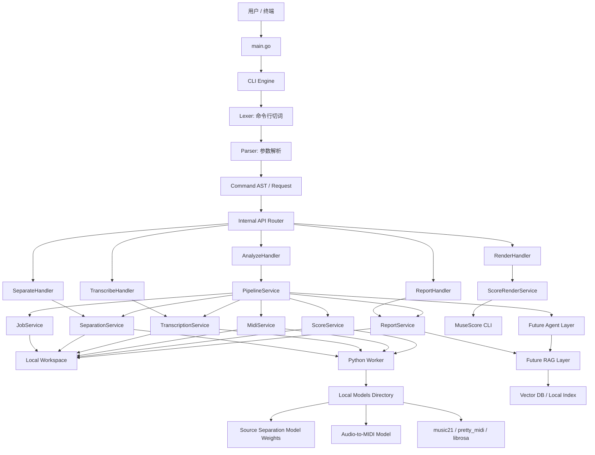

# 441hz 项目蓝图

## 1. 项目定位

`441hz` 是一个基于 Go 的跨平台 AI 音频转谱 CLI 工具。第一阶段目标是处理完整歌曲，并验证一条最小可行链路：

1. 输入一首音频文件。
2. Go CLI 创建本地任务目录。
3. Go 调用 Python Worker。
4. Python 直接加载项目目录下已经下载好的本地模型。
5. Python 将音频按声源拆分为多个音轨。
6. 拆分后的音轨保存到本地任务目录。
7. 后续再扩展 MIDI、MusicXML、五线谱 PDF、Markdown/HTML 报告。

项目的核心不是一开始就做到专业扒谱级准确率，也不是为了追概念强行加入 RAG/Agent、数据库、对象存储或缓存，而是先构建一个清晰、可运行、可扩展的本地 AI 音乐处理流水线：

- Go 负责 CLI、任务编排、路由、Handler、Service、报告生成和跨平台分发。
- Python 负责直接加载本地模型权重，执行音源分离、音频转 MIDI、音乐信息处理。
- 本地文件系统负责保存输入音频、拆分音轨、MIDI、五线谱和报告。
- RAG 和 Agent 暂时只作为后续可选扩展，用来做策略选择、错误解释、谱面修复建议和质量报告。

## 2. 第一阶段 MVP

第一版先支持完整歌曲分析，并输出一套完整任务产物。

```text
song.wav
  -> workspace/jobs/{job_id}/
       input/
         song.wav
       stems/
         vocals.wav
         drums.wav
         bass.wav
         other.wav
       metadata/
         job.json
         separation.json
       logs/
         pipeline.log
```

第一版建议先做这些命令：

```bash
441hz analyze song.wav --mode balanced --report md,html
441hz separate song.wav
441hz inspect workspace/jobs/{job_id}
```

第一阶段只要求 `separate` 能跑通本地模型拆轨。`transcribe`、`render`、`report` 先保留命令设计，后续分阶段实现。

当前工程骨架先实现 Python Worker mock：Go 通过 gRPC 调用 Python Worker，workspace 目录、metadata 写入、stem 文件输出都会先跑通；真实 Demucs 推理作为下一步替换 `pyworker/worker.py` 内部逻辑。

## 3. 总体架构图



## 4. Go 侧分层设计

### 4.1 main

`main.go` 只负责启动程序，不承载业务逻辑。

职责：

- 读取 `os.Args`。
- 初始化 CLI Engine。
- 初始化 Router、Handler、Service。
- 将命令交给 CLI Engine 执行。
- 统一处理错误码和终端输出。

建议后续形态：

```text
cmd/441hz/main.go
internal/cli/
internal/router/
internal/handler/
internal/service/
internal/domain/
internal/report/
internal/config/
internal/logging/
```

### 4.2 CLI Engine

你希望不用 CLI 框架，自己手搓 parser，这个方向是可以的，而且适合作为面试亮点。CLI 层建议参考 RAGFlow 的设计：把“输入文本”“词法 token”“语法命令”“业务请求”拆开，而不是在一个 parser 里直接拼出所有业务参数。

CLI Engine 建议分为四步：

```text
raw args
  -> lexer
  -> parser
  -> cli command
  -> command request
```

示例：

```bash
441hz analyze "song.wav" --mode pro --report md,html
```

可以解析成：

```json
{
  "command": "analyze",
  "args": ["song.wav"],
  "flags": {
    "mode": "pro",
    "report": "md,html"
  }
}
```

核心分层如下：

| 层 | 职责 | 441hz 当前建议 |
| --- | --- | --- |
| `cmd/441hz/main.go` | 只负责启动、依赖组装、单命令/交互模式选择 | 将 `os.Args[1:]` 直接交给 CLI，不重新 `strings.Join` 破坏 shell token |
| `internal/cli/lexer.go` | 只负责词法分析，把输入切成 `Token` | 支持 command、keyword、positional、`--flag`、`--flag=value`、单双引号字符串、`;`、EOF |
| `internal/cli/parser.go` | 递归下降 parser，把 token 解析成语义命令 | 类似 RAGFlow 的 `parseUserCommand`，按命令分派到 `parseAnalyze`、`parseSeparate`、`parseInspect` |
| `internal/cli.Command` | CLI 层语义对象 | `Type` 表示动作，`Params` 保存已命名参数，避免业务层理解 token |
| `internal/domain.CommandRequest` | 内部 API Router 请求 | 由 `Command.ToRequest()` 适配生成，保持 Router/Handler/Service 可复用 |
| `internal/router` | 内部 API 分发 | 继续按 `/commands/{command}` 调 Handler |

这样做有几个好处：

- Lexer 不知道业务命令，后续新增 token 或语法不会影响 Handler。
- Parser 不直接调用 Service，只产出稳定的 `Command`。
- CLI 语法和内部业务请求之间有显式适配层，后续可以同时支持 `441hz separate song.wav` 和更自然的小语言形式。
- 交互模式和单命令模式走同一套 parser，行为一致。

第一版 parser 不需要做得过度复杂，先支持：

- command：`analyze`、`separate`、`transcribe`、`render`、`report`、`inspect`
- positional args：普通位置参数
- long flag：`--mode pro`
- long flag with value：`--mode=pro`
- boolean flag：`--verbose`
- list flag：`--report md,html`
- help：`441hz help`、`441hz analyze --help`
- SQL-like 结束符：交互模式中可接受可选 `;`，例如 `separate "song.wav";`

暂时不支持复杂 shell 语法，因为 shell 本身已经会处理引号和转义。单命令模式不要把 `os.Args` 重新拼接成字符串再解析，否则路径中包含空格时会丢失原始参数边界；应该提供 `ParseArgs(args []string)`，内部只在必要时使用 shell-safe quoting 拼成 parser 输入。

建议的语义命令对象：

```go
type Command struct {
    Type   string
    Params map[string]interface{}
}
```

建议的解析分派：

```text
Parser.Parse
  -> parseCommand
    -> parseHelpCommand
    -> parseAnalyzeCommand
    -> parseSeparateCommand
    -> parseInspectCommand
    -> parseGenericCommand
```

其中 `parseAnalyzeCommand`、`parseSeparateCommand`、`parseInspectCommand` 负责把第一个位置参数命名为 `input` 或 `job_dir`，公共 flag 解析复用同一个 `parseArgsAndFlags`。最后由 `Command.ToRequest()` 生成：

```json
{
  "command": "separate",
  "args": ["song.wav"],
  "flags": {
    "mode": "balanced"
  }
}
```

### 4.3 Internal API Router

虽然这是 CLI，不是真的 HTTP 服务，但可以设计一个“内部 API Router”。这样后续切到桌面端或本地 Web API 时，业务入口可以复用。

路由层职责：

- 根据 `CommandRequest.Command` 找到对应 Handler。
- 做基础参数校验。
- 返回统一响应结构。

示例内部路由：

```text
analyze    -> AnalyzeHandler
separate   -> SeparateHandler
transcribe -> TranscribeHandler
render     -> RenderHandler
report     -> ReportHandler
inspect    -> InspectHandler
```

### 4.4 Handler

Handler 负责把 CLI 请求转成业务调用。

Handler 不直接处理模型、不直接操作复杂文件、不拼接大量业务逻辑。

例如：

```text
AnalyzeHandler
  -> 校验输入音频存在
  -> 读取 mode/report 参数
  -> 调用 PipelineService.RunAnalyze
  -> 将结果交给 Presenter 输出
```

### 4.5 Service

Service 是业务核心。

建议第一阶段设计这些 Service：

| Service | 职责 |
| --- | --- |
| `JobService` | 创建任务目录、维护任务状态、管理本地产物索引 |
| `PipelineService` | 编排完整 analyze 流程 |
| `SeparationService` | 调 Python 做音源分离 |
| `TranscriptionService` | 调 Python 将 stem 转 MIDI |
| `MidiService` | MIDI 清洗、合并、量化 |
| `ScoreService` | MIDI 转 MusicXML |
| `ScoreRenderService` | 调 MuseScore 将 MusicXML 渲染为 PDF |
| `ReportService` | 生成 `report.json`、`report.md`、`report.html` |
| `ConfigService` | 管理配置文件和默认参数 |

### 4.6 本地 Workspace

第一阶段不引入数据库、MinIO 或缓存。所有任务产物都保存在项目目录下的本地 workspace 中。

推荐目录：

```text
workspace/
  jobs/
    {job_id}/
      input/
      stems/
      midi/
      score/
      reports/
      metadata/
      logs/
```

原因：

- 本地 CLI 项目最简单，方便调试。
- 音频、stem、MIDI、PDF 都是文件型产物，直接放文件系统最自然。
- 后续如果需要数据库，可以从 `metadata/*.json` 平滑迁移。
- 后续如果需要 MinIO，也可以把 `workspace/jobs/{job_id}` 映射成对象存储 key。

第一阶段的元数据用 JSON 文件保存：

```text
metadata/job.json
metadata/separation.json
metadata/artifacts.json
```

这样可以先避免数据库复杂度，同时仍然保留“任务状态、文件索引、处理参数、模型版本”等信息。

### 4.7 产物应该保存到哪里

第一阶段建议统一保存到：

```text
workspace/jobs/{job_id}/
```

不建议第一阶段使用 MinIO：

- MinIO 更适合模拟云对象存储或多人/服务端场景。
- 当前是本地 CLI，小文件系统足够。
- 引入 MinIO 会增加部署复杂度，反而分散第一阶段重点。

不建议第一阶段使用数据库保存文件：

- 音频、stem、PDF 属于大文件，数据库 BLOB 不利于调试。
- 文件系统可以直接试听、打开、渲染、删除。
- 后续有需要再把元数据迁移到 SQLite。

暂时不需要缓存：

- 对本地小项目来说，任务目录天然就是“结果缓存”。
- 如果同一个输入音频已经处理过，可以后续通过 `sha256` 判断是否复用任务目录。
- 第一阶段先不做自动缓存策略，避免复杂化。

推荐完整产物结构：

```text
workspace/
  jobs/
    20260605-153012-a1b2c3/
      input/
        original.wav
      stems/
        vocals.wav
        drums.wav
        bass.wav
        other.wav
      midi/
        vocals.mid
        drums.mid
        bass.mid
        other.mid
        merged.mid
      score/
        score.musicxml
        score.pdf
        preview.png
      reports/
        report.json
        report.md
        report.html
      metadata/
        job.json
        artifacts.json
        separation.json
        transcription.json
        score.json
      logs/
        pipeline.log
```

第一阶段只要求写出：

```text
input/original.wav
stems/*.wav
metadata/job.json
metadata/separation.json
logs/pipeline.log
```

MIDI 和五线谱目录可以先创建，但里面的真实产物放到第二、第三阶段再生成。

## 5. Python Worker 怎么理解

你现在不熟 Python，也不熟 AI 框架，所以第一阶段不要把 Python 写成复杂服务。它只是一个“被 Go 调用的工具进程”。

### 5.1 Go 和 Python 如何通讯

第一阶段使用 gRPC 通讯。Go 仍然可以用 `os/exec` 启动本地 Python Worker 进程，但真正的业务请求通过 gRPC 方法传输，而不是 stdin/stdout JSON。

```text
Go CLI
  -> os/exec 启动 Python gRPC Worker
  -> Go gRPC client 调 AudioWorker.Separate
  -> Python gRPC server 接收 input/model/output/config 路径
  -> Python 执行模型推理
  -> Python 输出文件和 metadata
  -> Python gRPC response 返回 stems 和 metadata 路径
  -> Go 更新 job metadata 和 artifacts
```

不建议第一阶段引入 HTTP server、消息队列或长期常驻 Python 服务。原因是：

- 当前项目是本地 CLI，由 Go 按需启动 Python gRPC Worker 足够用。
- 音频拆轨本身耗时较长，启动 Python 进程的成本可以接受。
- 进程边界清晰，Go 和 Python 的职责容易讲清楚。
- 后续如果性能需要，再把 Python Worker 改成常驻服务。

gRPC 接口先定义为：

```proto
service AudioWorker {
  rpc Separate(SeparateRequest) returns (SeparateResponse);
}

message SeparateRequest {
  string input_path = 1;
  string model_dir = 2;
  string output_dir = 3;
  string metadata_path = 4;
  string mode = 5;
}
```

Go 侧职责：

- 启动 Python Worker。
- 连接本地 gRPC 地址。
- 调用 `Separate`。
- 读取 gRPC response。
- 写 `job.json`、`artifacts.json` 和 `pipeline.log`。

Python 侧职责：

- 启动 gRPC server。
- 接收 `SeparateRequest`。
- 从 `models/` 加载本地模型。
- 写出 `stems/*.wav` 和 `separation.json`。
- 返回 `SeparateResponse`。

第一版 Python Worker 的边界应该非常清楚：

```text
Go 不关心模型细节。
Python 不关心 CLI 交互。
Go 只传入文件路径和参数。
Python 只输出文件和 JSON。
```

### 5.2 本地模型如何放置

你希望模型文件直接保存到项目中，Python 直接通过代码调用。这可以做，但要注意模型权重通常很大，不建议提交到 Git。

推荐目录：

```text
models/
  separation/
    demucs/
      README.md
      config.json
      weights/
        model.th
  transcription/
    basic-pitch/
      README.md
      config.json
      weights/
        model.savedmodel/
```

建议 Git 里保留：

- `models/**/README.md`
- `models/**/config.example.json`
- 下载说明
- 校验 hash

不建议 Git 里提交：

- `.pt`
- `.pth`
- `.th`
- `.onnx`
- `.safetensors`
- TensorFlow `savedmodel`
- 大型 GGUF 文件

第一阶段可以用 `.gitignore` 忽略真实权重，只让本地开发机保存模型文件。

### 5.3 Python 如何加载本地模型

Python Worker 不从网络下载模型，也不调用 Ollama 端口，而是接收 `--model-dir` 参数，从项目目录读取模型配置和权重。

示意流程：

```text
worker.py separate
  -> 读取 --model-dir
  -> 加载 models/separation/demucs/config.json
  -> 加载 models/separation/demucs/weights/model.th
  -> 读取输入音频
  -> 执行 source separation
  -> 写出 stems/*.wav
  -> 写出 metadata/separation.json
```

Python 伪代码：

```python
def separate(input_path: str, model_dir: str, output_dir: str, metadata_path: str):
    model_config = load_config(model_dir)
    model = load_local_separation_model(model_dir, model_config)
    stems = run_separation(model, input_path)
    write_stems(stems, output_dir)
    write_metadata(metadata_path, stems, model_config)
```

这里的 `load_local_separation_model` 未来可以先接 Demucs 的本地权重。等音源分离跑通后，再考虑 MIDI 转录模型。

### 5.4 Python Worker 初期可接的能力

| 阶段 | Python 能力 | 可能工具 |
| --- | --- | --- |
| 音源分离 | 完整歌曲拆成 stems | Demucs |
| 音频转 MIDI | stem 转 MIDI | Basic Pitch |
| MIDI 处理 | 合并、量化、去噪 | pretty_midi / mido |
| 音乐分析 | 调号、拍号、和弦、音符结构 | music21 |
| 音频分析 | 波形、频谱、onset、tempo | librosa |

### 5.5 后续为什么可能升级成 Python Service

第一版使用进程调用最简单。后面如果性能或交互要求变高，可以升级为：

```text
Go <-> gRPC <-> Python AI Service
```

升级后好处：

- 模型可以常驻内存，不用每次启动 Python。
- Go 可以流式接收进度。
- 更适合桌面端或本地 Web API。
- 更容易做队列和并发控制。

### 5.6 分阶段工具选型

下面是基于官方资料核实后的阶段性工具选型。第一阶段只实现音源分离，但规划上保留 MIDI、MusicXML 和五线谱渲染链路。

#### 阶段 1: 音源分离

| 工具 | 定位 | 结论 |
| --- | --- | --- |
| Demucs v4 | Python / PyTorch 音源分离 | 第一阶段主线 |
| Spleeter | Python / TensorFlow 音源分离 | 备选方案 |

Demucs v4 适合作为第一阶段主线。官方说明它是第 4 版，使用 Hybrid Transformer Demucs，能够分离 `drums`、`bass`、`vocals`、`other`，并提供 PyPI 安装方式。需要注意的是，原 `facebookresearch/demucs` 仓库已经不是活跃维护状态，后续只处理重要 bug，所以项目中要把 Demucs 包装在 `SeparationService` 和 Python Worker 后面，避免和业务层强绑定。

Spleeter 可以作为轻量备选。它提供 2 stems、4 stems、5 stems 模型，速度快，但基于 TensorFlow，且官方文档中提示过 Apple M1 相关兼容问题。对 macOS 本地项目来说，优先级低于 Demucs。

阶段 1 推荐策略：

```text
默认：Demucs v4 / htdemucs
备选：Spleeter 4 stems
输出：workspace/jobs/{job_id}/stems/*.wav
```

#### 阶段 2: 旋律/音高识别到 MIDI

| 工具 | 定位 | 结论 |
| --- | --- | --- |
| Basic Pitch | Spotify audio-to-MIDI | 第二阶段主线 |
| Omnizart | 更完整的自动音乐转录工具箱 | 实验/备选 |
| librosa | 音频分析基础库 | 辅助分析 |
| mir_eval | MIR 评估库 | 质量评估 |

Basic Pitch 适合作为第二阶段主线。官方说明它是 Spotify Audio Intelligence Lab 的 Automatic Music Transcription Python 库，可以 `pip install basic-pitch`，输入音频后生成 MIDI，并且支持 TensorFlow、CoreML、TensorFlowLite、ONNX 等模型运行时。它也明确说明“one instrument at a time”效果最好，因此和阶段 1 的拆轨结果天然匹配。

Omnizart 可以作为后续实验方案。它支持 pitched instruments、vocal melody、chords、drum events、beat 等多类转录，但 PyPI 元信息显示 Python 版本约束较老，因此不建议第一批主线接入。

`librosa` 和 `mir_eval` 不作为核心模型，而作为辅助工具：

- `librosa` 用于 tempo、onset、频谱、响度等分析。
- `mir_eval` 用于后续有参考数据时评估旋律、节拍、转录质量。

阶段 2 推荐策略：

```text
默认：Basic Pitch
输入：workspace/jobs/{job_id}/stems/*.wav
输出：workspace/jobs/{job_id}/midi/*.mid
附加：note_events.csv、model_outputs.npz 可选保存
```

#### 阶段 3: MIDI 到五线谱

| 工具 | 定位 | 结论 |
| --- | --- | --- |
| music21 | MIDI/MusicXML 解析、转换和音乐分析 | 第三阶段主线 |
| MuseScore CLI | 将 MusicXML 渲染为 PDF/SVG/PNG | 第三阶段主线 |

music21 适合负责 MIDI 到 MusicXML 的中间转换和后处理。官方文档说明 `music21.converter.parse()` 可以加载多种格式，包含 MIDI 和 MusicXML；MIDI 转换后还可以做量化、调号、拍号、声部等后处理。

MuseScore CLI 适合负责最终谱面渲染。MuseScore 官方手册列出 MusicXML、MIDI、PDF、PNG、SVG 等导出格式，因此它适合作为 `ScoreRenderService` 的底层渲染工具。

阶段 3 推荐策略：

```text
MIDI
  -> music21 后处理
  -> MusicXML
  -> MuseScore CLI
  -> PDF/SVG/PNG 五线谱
```

#### 官方资料链接

- Demucs PyPI: https://pypi.org/project/demucs/
- Demucs GitHub: https://github.com/facebookresearch/demucs
- Spleeter GitHub: https://github.com/deezer/spleeter
- Basic Pitch GitHub: https://github.com/spotify/basic-pitch
- Omnizart PyPI: https://pypi.org/project/omnizart/
- music21 docs: https://www.music21.org/music21docs/
- MuseScore export docs: https://handbook.musescore.org/en_gb/file-management/file-export
- librosa docs: https://librosa.org/doc/main/
- mir_eval docs: https://mir-eval.readthedocs.io/stable/

## 6. RAG 可以做什么

RAG 的全称是 Retrieval-Augmented Generation，中文可以理解为“检索增强生成”。

普通 LLM 只靠模型自己的知识回答。RAG 会先从你的知识库里检索相关资料，再把资料交给 LLM，让它基于资料回答。

在 `441hz` 里，RAG 不应该负责直接识别音符。它更适合做这些事：

### 6.1 乐理和格式解释

用户问：

```text
为什么这个 MIDI 转出来的谱面有很多 32 分音符？
```

RAG 可以检索：

- MIDI 量化规则
- MusicXML 表示方式
- 项目自己的后处理文档
- 历史错误案例

然后生成解释：

```text
这通常是因为转录模型把滑音、噪声或延音尾部识别成多个短音。
建议提高 quantize grid，或启用 short-note merge 策略。
```

### 6.2 模型文档检索

RAG 可以存储：

- Demucs 使用说明
- Basic Pitch 参数说明
- MuseScore CLI 参数说明
- 项目内部 pipeline 文档

当 Agent 需要选择策略时，可以先查这些资料。

### 6.3 失败案例知识库

每次处理失败或结果很差，都可以记录：

```json
{
  "case": "鼓声泄漏到 bass stem",
  "symptom": "bass.mid 出现大量短促重复音",
  "solution": "提高 bass stem 的能量阈值，启用 short note filter"
}
```

后续遇到类似问题，RAG 可以检索历史案例，辅助生成修复建议。

## 7. Agent 可以做什么

Agent 可以理解成“会使用工具、会分步骤决策的 LLM 控制器”。

普通 LLM 是你问一句，它答一句。Agent 则可以：

1. 观察当前任务状态。
2. 选择下一个工具。
3. 执行工具。
4. 读取结果。
5. 再决定下一步。

在 `441hz` 中，Agent 不应该替代音频模型，而应该做“智能编排”和“智能修复建议”。

### 7.1 Pipeline Agent

职责：根据音频类型自动选择处理流程。

例子：

```text
如果检测到是钢琴独奏：
  跳过音源分离，直接转 MIDI。

如果检测到是完整乐队：
  先做 stems 分离，再分别转录。

如果检测到节奏复杂：
  使用 pro 模式，启用更细粒度量化。
```

它可以调用的工具：

- `analyze-audio-metadata`
- `separate`
- `transcribe`
- `clean-midi`
- `render-score`
- `generate-report`

### 7.2 Score Repair Agent

职责：检查生成的 MIDI/MusicXML，给出修复建议，甚至自动执行安全修复。

它可以发现：

- 小节拍数不完整
- 过多 1/64 或 1/32 短音符
- 同一 stem 里出现不合理音域
- 鼓轨被错误转成旋律音符
- bass stem 出现大量高音碎片

它可以建议：

- 合并短音
- 删除低置信度音符
- 调整量化粒度
- 分离左右手声部
- 标记需要人工检查的小节

### 7.3 Report Agent

职责：生成更像专家写的分析报告。

报告可以包括：

- 音频基本信息
- 拆轨结果说明
- 每个 stem 的识别质量
- MIDI 清洗策略
- 乐谱生成风险
- 推荐人工复查位置
- 后续优化建议

### 7.4 Interview Agent Angle

面试时可以这样解释：

```text
LLM 没有直接参与音高识别，因为这是音频模型更擅长的任务。
我把 Agent 设计在 pipeline 编排、错误解释、质量评估和修复建议层。
这样可以避免滥用大模型，同时让系统具备可解释性和自我修复能力。
```

这是一个很好的技术判断点。

## 8. 后续技术路线

### 8.1 Phase 1: CLI MVP

- 完成简单架构设计。
- 自研 CLI parser。
- 使用 Gin 搭建内部 Router/Handler/Service。
- 创建本地任务目录。
- 明确 Go 与 Python 通过 gRPC 通讯。
- Python Worker 先用 mock 跑通 gRPC，后续直接加载项目 `models/` 下的本地模型。
- 跑通音源分离流程，输出 `stems/*.wav`。
- 写出 `metadata/job.json`、`metadata/separation.json` 和 `logs/pipeline.log`。

### 8.2 Phase 2: 接入真实音频处理

- 完善本地 Demucs 权重管理和加载。
- 接入 Basic Pitch 做 audio-to-MIDI。
- 输出每个 stem 的 MIDI。
- 生成合并 MIDI。

### 8.3 Phase 3: 乐谱导出

- 用 Python 将 MIDI 转 MusicXML。
- 调 MuseScore CLI 输出 PDF。
- 生成 HTML 报告。

### 8.4 Phase 4: 质量评估

- 统计每个 stem 的音符数量、音域、时值分布。
- 检测异常短音。
- 检测疑似噪声音符。
- 输出质量评分。

### 8.5 Phase 5: RAG 和 Agent

- 建立本地知识库。
- 接入向量检索。
- 让 Report Agent 基于检索资料生成解释。
- 让 Score Repair Agent 输出修复建议。

### 8.6 Phase 6: 桌面端

- 保留 CLI 和 Service 层。
- 新增桌面 UI。
- 复用 Router/Handler/Service。
- UI 只负责展示任务状态、波形、MIDI、谱面和报告。

## 9. 近期建议目录结构

```text
441hz/
  cmd/
    441hz/
      main.go
  internal/
    cli/
      lexer.go
      parser.go
      command.go
    router/
      router.go
    handler/
      analyze_handler.go
      separate_handler.go
      transcribe_handler.go
      render_handler.go
      report_handler.go
    service/
      pipeline_service.go
      job_service.go
      separation_service.go
      transcription_service.go
      midi_service.go
      score_service.go
      report_service.go
    domain/
      job.go
      artifact.go
      command.go
      report.go
    worker/
      python_runner.go
    presenter/
      terminal_presenter.go
  pyworker/
    worker.py
    requirements.txt
  models/
    separation/
      demucs/
        README.md
        config.example.json
        weights/
    transcription/
      basic-pitch/
        README.md
        config.example.json
        weights/
  workspace/
    jobs/
  configs/
    config.example.yaml
  docs/
    PROJECT_BLUEPRINT.md
```

## 10. 第一批编码任务

建议按这个顺序开始：

1. 移动 `main.go` 到 `cmd/441hz/main.go`。
2. 实现 `internal/cli` 的基础 parser。
3. 实现 `internal/router`。
4. 实现 `JobService`，负责创建 `workspace/jobs/{job_id}`。
5. 实现 `separate` 命令的 Handler 和 Service mock。
6. 接入 Python Worker mock，跑通 Go 调 Python。
7. 约定 `models/separation/demucs` 的本地模型目录。
8. Python Worker 从 `--model-dir` 读取本地模型配置。
9. 输出 `stems/*.wav` 和 `metadata/separation.json`。
10. 再逐步替换成真实 Demucs 分离逻辑。

第一批代码不急着接真实 AI 模型。先把工程骨架跑通，后续每接入一个模型都只是替换 Service 的底层实现。

## 11. 项目边界

第一阶段明确不做：

- 不训练自有模型。
- 不承诺交响乐级专业扒谱。
- 不做桌面端。
- 不做复杂 Web 前端。
- 不做多人协作和云端账户系统。

第一阶段要做到：

- CLI 能跑。
- 任务目录清晰。
- 本地模型目录清晰。
- Python Worker 能被 Go 调用。
- 拆分音轨能保存到本地 workspace。
- 处理链路可恢复、可观察。
- 报告可读。
- Go 和 Python 边界清晰。
- 后续能自然扩展到 Agent、RAG、桌面端。
